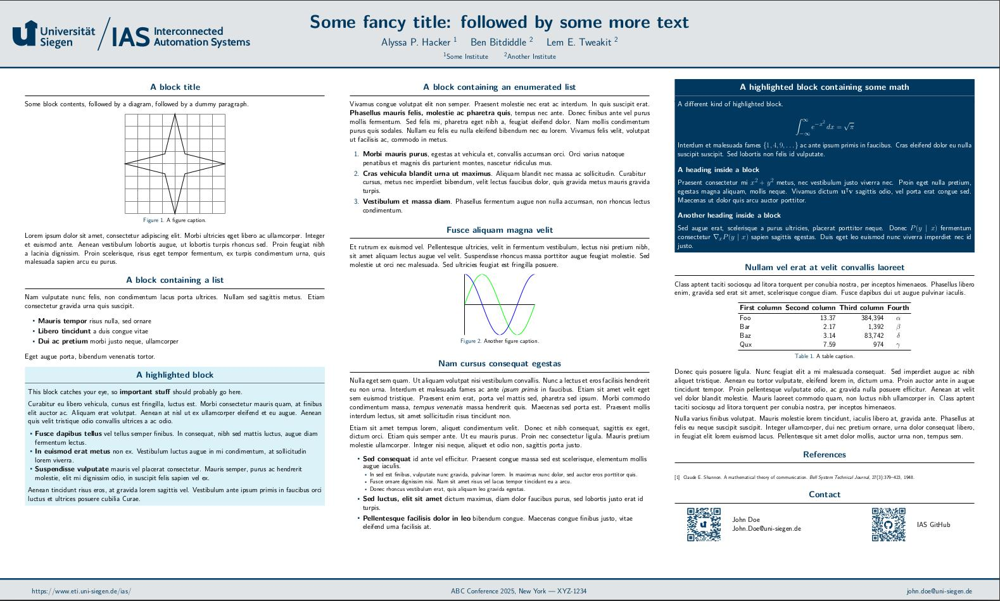
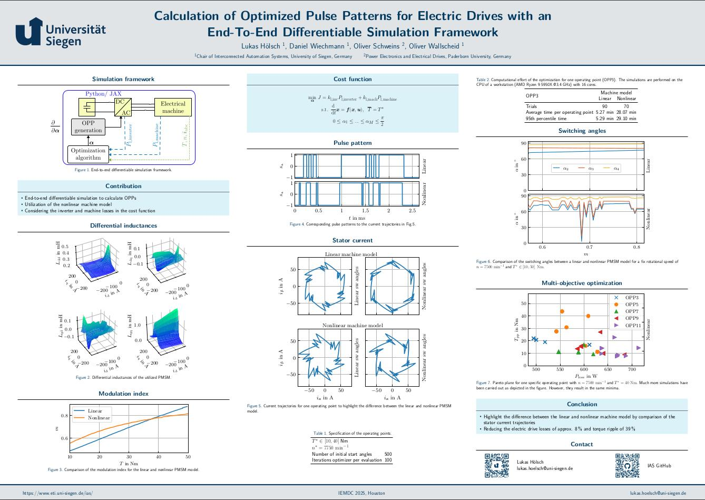

# UniSiegen-Gemini 

Gemini is a modern LaTeX [beamerposter] theme.

This repository serves as University of Siegen poster template based on [anishathalye/Gemini](https://github.com/anishathalye/gemini).

## Poster Template
[](examples/generic-poster.pdf)

## Dependencies

* A TeX installation that includes [pdfTeX]
  * You also need `latexmk` if you want to use the provided `Makefile`
* LaTeX package dependencies including beamerposter (these usually come with
  your TeX installation, but if not, you can get them from [CTAN])

## Usage

1. Copy the files in this repository (or clone the repository)

1. In `generic-poster.tex`, set up your paper size, column layout, and scale the
   content as necessary

1. Edit the content in `generic-poster.tex` as necessary.

1. If you use Windows, you can use [VSCode](https://code.visualstudio.com/) with [LaTeX-Workshop](https://github.com/James-Yu/LaTeX-Workshop) extension to build your project. Please make sure that automatic dependency installation for [MiKTeX](https://miktex.org/) is turned on.

1. If you use Linux, use `make` to build your project.

1. You can also use following command to manually build your project :
  `latexmk -pdflatex='pdflatex -interaction nonstopmode' -pdf your_poster.tex`

## Makefile Info

* Makefile by default executes target `main` which builds `generic-poster.tex` but additional targets are also available.

* `clean` : Deletes all the output files including `.pdf` and `.log` files

* `check_dependencies` : If you are on linux machine, checks for dependencies

* `generic-poster.pdf` : Builds `generic-poster.tex`

* `first-poster.pdf` : Builds `first-poster.tex`

## Folder Organization

* `assets` : Contains all the design asset files used for the poster

* `fig` : Contains all the figure files used for the poster

* `examples` : Contains example posters

## Themes

Gemini currently includes the following color themes according to [design guidelines](https://design.uni-siegen.de/):

* `gemini`

* `university of siegen` (default)

It's also easy to make your own!

### Example

1. `first-poster.tex`

[](examples/first-poster.pdf)

## Design goals

* **Minimal**: clean and easy to read, so that the emphasis is on the content
* **Batteries included**: works and looks good out of the box
* **Easy theming**: easy to create and use a new color theme

## Contributing

- We recommend using [VSCode](https://code.visualstudio.com/) as code editor.
- [Ruff](https://github.com/astral-sh/ruff) should be installed.

    ```bash
    pip install ruff
    ```
- It is expected that [LaTeX Workshop](https://marketplace.visualstudio.com/items?itemName=James-Yu.latex-workshop) and [Ruff](https://marketplace.visualstudio.com/items?itemName=charliermarsh.ruff) extensions are installed so that formatting of the code is achieved automatically.
- Please open an issue or pull request to suggest changes. Critical feedback and improvement hints are always welcome and highly appreciated!

<!--
## License

Copyright (c) [Chair of IAS, University of Siegen]. Released under the MIT License. See
[LICENSE.md][license] for details.

-->

[beamerposter]: https://github.com/deselaers/latex-beamerposter
[pdfTeX]: https://tug.org/applications/pdftex/
[CTAN]: https://ctan.org/
[license]: LICENSE.md
[Chair of IAS, University of Siegen]: https://www.eti.uni-siegen.de/ias/
