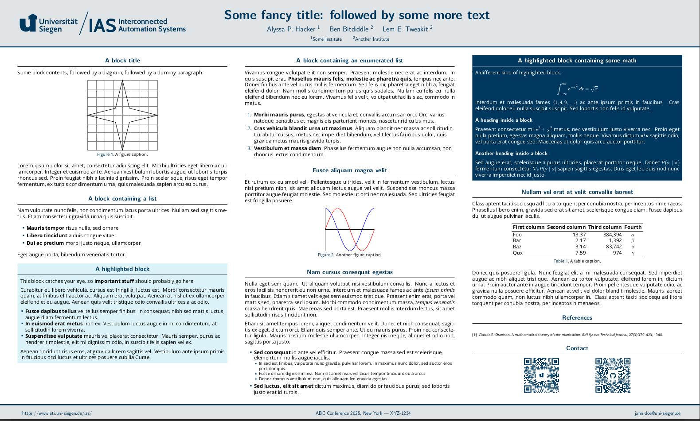
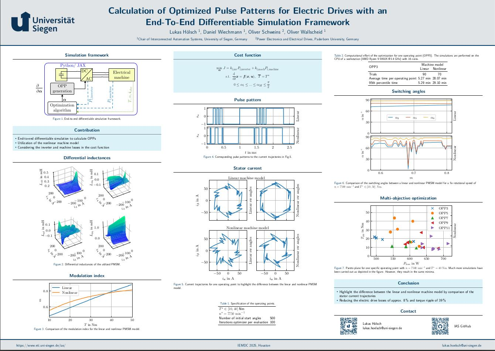

# UniSiegen Gemini 

Gemini is a modern LaTeX [beamerposter] theme.

This repository serves as University of Siegen poster template based on [anishathalye/Gemini](https://github.com/anishathalye/gemini).

## Poster Template

## Dependencies

* A TeX installation that includes [pdfTeX]
    * You also need `latexmk` if you want to use the provided `Makefile`
* LaTeX package dependencies including beamerposter (these usually come with
  your TeX installation, but if not, you can get them from [CTAN])

## Usage

1. Copy the files in this repository (or clone the repository)

1. In `poster.tex`, set up your paper size, column layout, and scale the
   content as necessary

1. Edit the content in `poster.tex` as necessary.

1. Run `make` to build your poster

## FAQ

See the [FAQ] in the Wiki for answers to frequently asked questions such as how
to add an institution logo to the poster.

## Themes

Gemini currently includes the following color themes according to [design guidelines](https://design.uni-siegen.de/):

* `gemini` (default)
* `university of siegen`

It's also easy to make your own!

### Example

## Design goals

* **Minimal**: clean and easy to read, so that the emphasis is on the content
* **Batteries included**: works and looks good out of the box
* **Easy theming**: easy to create and use a new color theme

## Contributing

Contributions to Gemini such as bug reports, new themes, and new poster
components are greatly appreciated! Given the subjective nature of design,
you're encouraged to open an issue or pull request early to get feedback before
investing a lot of time in implementing a new feature.

## License

Copyright (c) [Chair of IAS, University of Siegen]. Released under the MIT License. See
[LICENSE.md][license] for details.

[beamerposter]: https://github.com/deselaers/latex-beamerposter
[pdfTeX]: https://tug.org/applications/pdftex/
[CTAN]: https://ctan.org/
[license]: LICENSE.md
[Chair of IAS, University of Siegen]: https://www.eti.uni-siegen.de/ias/
[FAQ]: https://github.com/anishathalye/gemini/wiki/FAQ
